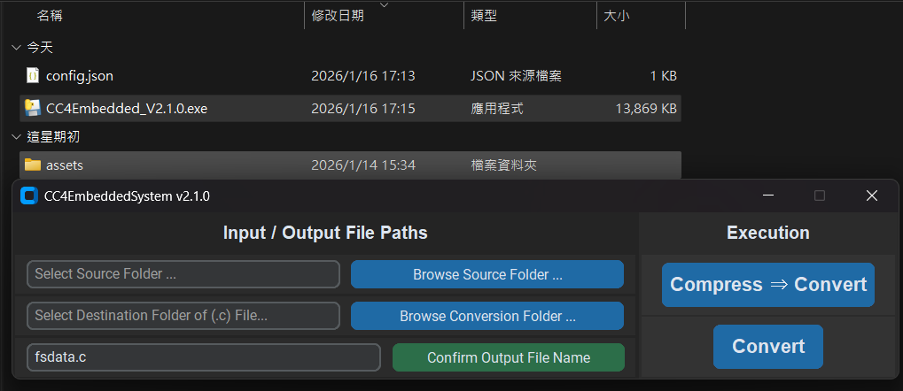

# CC4EmbeddedSystem V2
## Structure
### v2.0.1
```
<YOUR_DOWNLOAD_PATH>
├── CC4Embedded_v2.0.1.exe
└── config.json               // auto-generated
```
### v2.1.0
```
<YOUR_DOWNLOAD_PATH>
├── CC4Embedded_2.1.0.exe
├── assets                       // provided, you can replace to your version
│   ├── htmlcompressor-1.5.3.jar
│   ├── yuicompressor-2.4.8.jar
│   ├── makefsdata.exe
│   └── msvcr100d.dll
└── config.json                  // auto-generated
```

## Description
- Using python, uv and pyinstaller to re-write the whole project.
- Has a simple, intuitive gui (using custontkinter) to use.

## Screenshot
### v2.0.1
1. Choose tools paths and **MUST** click "Save Settings" button.
2. Choose the folder paths, and set the output c file name (default is fsdata.c).
3. Click execution button.

### v2.1.0
1. Choose the folder paths, and set the output c file name (default is fsdata.c).
2. Click execution buttons.


## Config.json format
This config file is in order to record your paths and output file name.
### v2.0.1
```json
{
    "tools": {
        "htmlcompressor": "",
        "yuicompressor": "",
        "makefsdata": "",
        "msvcr100d": ""
    },
    "folders": {
        "src": "",
        "compress_dest": "",
        "convert_dest": ""
    },
    "output_c_file": "fsdata.c"
}
```
### v2.1.0
```json
{
    "tools": {
        "htmlcompressor": "<YOUR_PATH>\\assets\\htmlcompressor-1.5.3.jar",
        "yuicompressor": "<YOUR_PATH>\\assets\\yuicompressor-2.4.8.jar",
        "makefsdata": "<YOUR_PATH>\\assets\\makefsdata.exe",
        "msvcr100d": "<YOUR_PATH>\\assets\\msvcr100d.dll"
    },
    "folders": {
        "src": "",
        "dest": ""
    },
    "output_c_file": "fsdata.c"
}
```

## Notices
### v2.0.1
- In v2.0.1, you need to **maunally** download and place the tools, also need to set the tool paths, because I want to avoid the case that user already have tools, and need to re-download again.
1. Your ```htmlcompressor*.jar``` and ```yuicompressor*.jar``` **MUST be placed under the same folder**, and ```makefsdata.exe``` and ```msvcr100d.dll``` also **MUST be placed under the same folder**.
2. Two compressors' name MUST in the following format:
    - ```htmlcompressor-x.y.z.jar```
    - ```yuicompressor-x.y.z.jar```
    - ```x.y.z``` is your version.
3. The default output converted c file name is ```fsdata.c```.
4. You MUST click the ```Save Settings``` and ```Confirm Output File Name``` buttons, and choose the paths before ```Compress``` or ```Convert```.
5. After ```Compress``` and ```Convert```, this tool will automatically open the path of output folder (or file) in Windows File Explorer.
### v2.1.0
1. All tools are in ```/assets```, if you want to use your specific version, simply replace it (note that the naming format is same as descriptions in v2.0.1).
2. ```"Compress ⇒ Convert"``` button will compress the original folder into a temporary folder, then convert it to c file. After conversion, the temparary folder will be deleted.