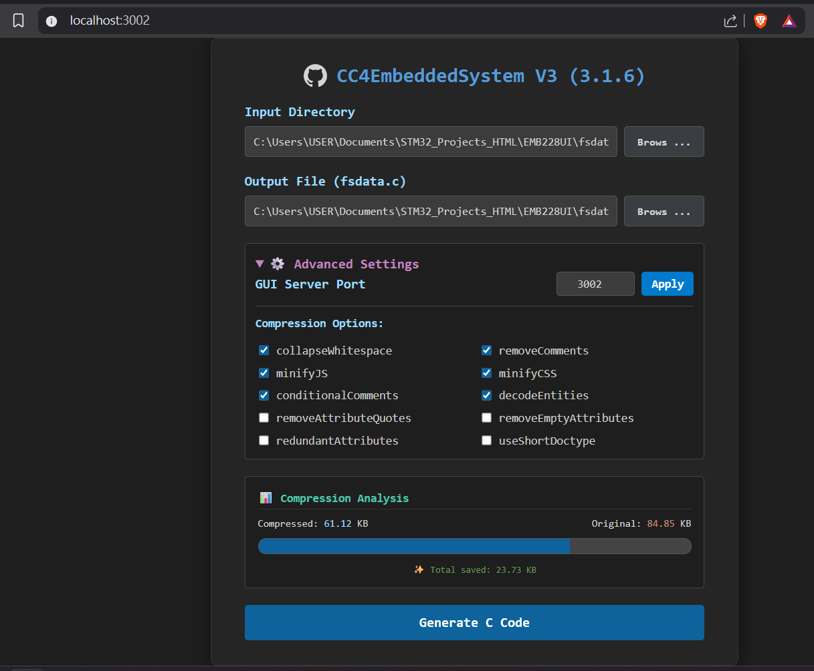

# CC4EmbeddedSystem V3
- This version based on [html-minifier-next](https://github.com/j9t/html-minifier-next) and rewrite [lwIP makefsdata](https://github.com/m-labs/lwip/tree/master/src/apps/httpd/makefsdata), run on localhost, default port: ```3000```.
- This tool is deployed on [npm package](https://www.npmjs.com/package/cc4-embedded-system).



## Structure
```text
CC4EmbeddedSystem/
├── src/
│   ├── gui.ts        // Express server & CLI entry point
│   │   ├── utils.ts  // To get latest tool version
│   └── makefsdata.ts // Core C code generation & minification logic
├── public/
│   └── index.html    // Web GUI dashboard
├── Sereenshot/
│   └── v3.1.6.png    // Demo image
├── node_modules/     // Required submodules during development
├── dist/             // Compiled JavaScript output (Auto-generated)
├── package.json      // Project configuration & dependencies
├── package-lock.json // Project configuration & dependencies
└── tsconfig.json     // TypeScript configuration
```

## Commands
### Normal Use
- Global installation
    ```bash
    npm install -g cc4-embedded-system
    cc4es # run
    ```
- Run once (no installation)
    ```bash
    npx cc4-embedded-system
    ```
- Specific port set during initialization
    ```bash
    cc4es --port 3002
    ```
### Development
```bash
# build
npm run build

# mimic global installation
npm link
cc4es

# publish
npm login
# npm version patch # if increase version
npm run build
npm publish --access public
```