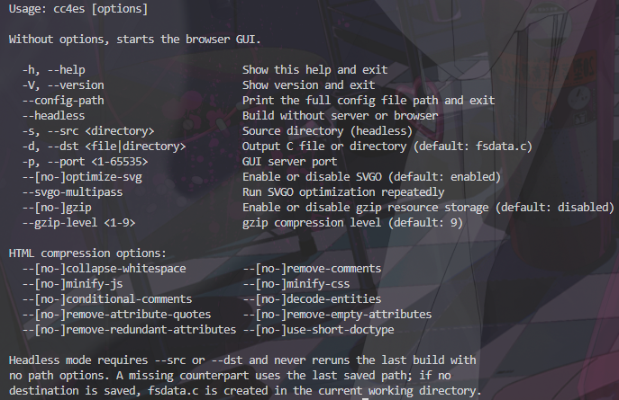
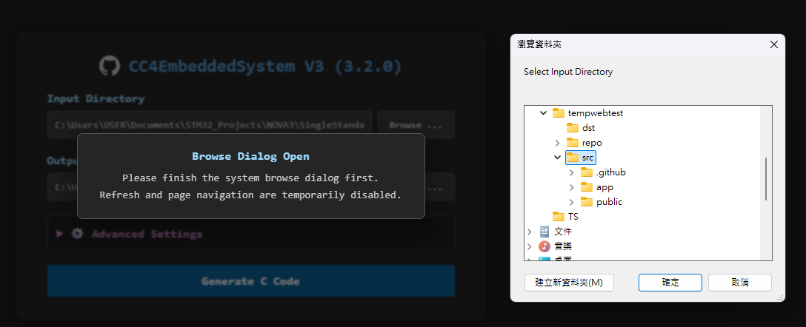
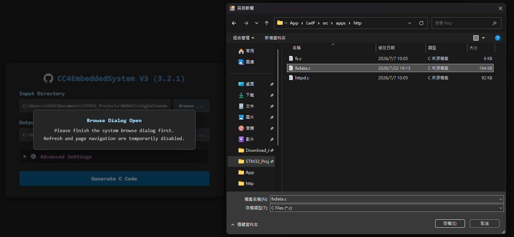
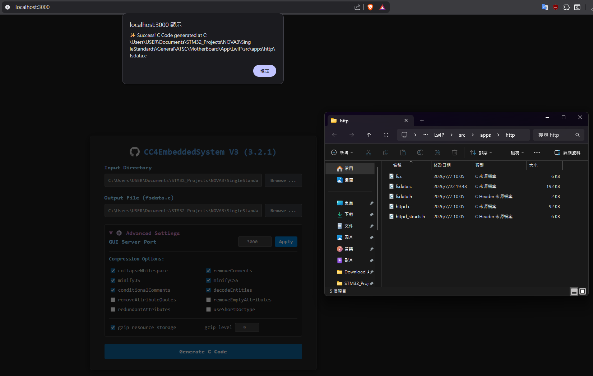
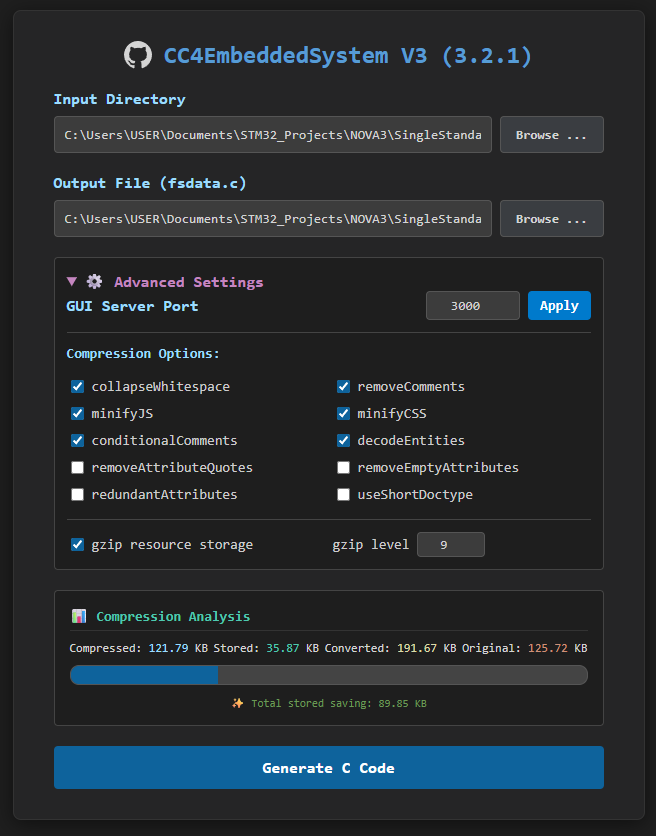

# CC4EmbeddedSystem V3
- V3.2.1 is a TypeScript/Node.js rewrite of [lwIP makefsdata](https://github.com/m-labs/lwip/tree/master/src/apps/httpd/makefsdata). GUI mode runs on localhost, default port: `3000`.
- Assets are handled by type: [html-minifier-next](https://github.com/j9t/html-minifier-next) processes HTML, [Lightning CSS](https://lightningcss.dev/) processes CSS, [esbuild](https://esbuild.github.io/) processes JavaScript, and [SVGO](https://svgo.dev/) processes SVG.
- Optional deterministic gzip storage reduces the Flash payload for text assets. The MCU sends the stored bytes unchanged; a gzip-capable HTTP client, normally a browser, decompresses the response.
- This tool is deployed on [npm package](https://www.npmjs.com/package/cc4-embedded-system).
- The last successful source/destination paths and gzip setting are automatically saved as `cc4es_configs.json` in the operating system's local application-data directory. On Windows this is `%LOCALAPPDATA%\\cc4-embedded-system\\cc4es_configs.json`.
- The config file is created only after the first successful build, and its complete path is printed at that time. Use `cc4es --config-path` to print it later.

## Demo
### CLI mode

### Select input directory

### Select output file path

### Results



## Structure
```text
CC4EmbeddedSystem/
├── src/
│   ├── gui.ts            // CLI entry point
│   ├── cli.ts            // Command-line parsing and help text
│   ├── server.ts         // Express GUI server
│   ├── config.ts         // Persistent paths and gzip options
│   ├── gzip-options.ts   // Shared gzip defaults and validation
│   ├── minify-options.ts // Shared HTML minifier options
│   ├── makefsdata.ts     // Asset routing, gzip, and C code generation
│   └── utils.ts          // Package version lookup
├── public/
│   └── index.html    // Web GUI dashboard
├── test/
│   └── cc4es.test.mjs // Native Node.js regression tests
├── Screenshot/
│   └── ...            // GUI and CLI screenshots
├── node_modules/     // Required submodules during development
├── dist/             // Compiled JavaScript output (Auto-generated)
├── package.json      // Project configuration & dependencies
├── package-lock.json // Project configuration & dependencies
└── tsconfig.json     // TypeScript configuration
```

## Build architecture

CC4ES never modifies the source directory. For each file it produces one final response body, writes the HTTP header and body into `fsdata.c`, and keeps lwIP's `FS_FILE_FLAGS_HEADER_INCLUDED` model.

```text
source file
  -> extension-based optimizer
       .html/.htm  html-minifier-next
       .css        Lightning CSS
       .js/.mjs    esbuild (or raw with --no-minify-js)
       .svg        SVGO
       other       raw copy
  -> final response body
  -> optional deterministic gzip when it is smaller
  -> HTTP header + fsdata.c byte array
```

HTML-only options such as `--remove-comments` are not applied to external JavaScript. This prevents an external `.js` file from being interpreted as an HTML comment. `--no-minify-js` and `--no-minify-css` keep their respective external assets unchanged, while HTML can still use its own minification options.

### Gzip storage

Gzip is optional and disabled by default. `--gzip` considers `.html`, `.htm`, `.css`, `.js`, `.mjs`, `.json`, `.svg`, `.xml`, `.txt`, and `.map`; binary and already-compressed resource types remain raw. A candidate is stored as gzip only when its gzip body is strictly smaller than its final raw body.

For gzip bodies, CC4ES writes `Content-Encoding: gzip` before the HTTP header terminator. The gzip mtime and OS metadata are normalized so the same input and options produce byte-identical output. A raw fallback has no `Content-Encoding` header.

This is a fixed storage representation, not runtime content negotiation: a gzip-enabled `fsdata.c` does not also store a raw duplicate and does not inspect `Accept-Encoding`. Enable gzip only when the target clients support it; use `--no-gzip` for legacy clients. No MCU decompressor, zlib dependency, lwIP change, or application-code change is required.

#### Measurement example

The following measured an example app build used `--gzip --gzip-level 9`. The exact result depends on the frontend assets, compiler settings, and firmware image format; treat it as an example rather than a universal saving guarantee.

| File | Without gzip | gzip level 9 | Reduction |
|---|---:|---:|---:|
| `fsdata.c` | 652,029 B | 197,764 B | 454,265 B (69.67%) |
| `app.elf` | 2,641,144 B | 2,555,120 B | 86,024 B (3.26%) |
| `app.hex` | 1,001,729 B | 751,917 B | 249,812 B (24.94%) |
| `app.bin` | 356,108 B | 267,292 B | 88,816 B (24.94%) |

The flashed memory regions show where the saving occurs:

| Region | Without gzip | gzip level 9 | Reduction |
|---|---:|---:|---:|
| `text` | 355,420 B | 266,604 B | 88,816 B |
| `data` | 680 B | 680 B | 0 B |
| `bss` | 83,280 B | 83,280 B | 0 B |

In this build, gzip saved **88,816 bytes** of Flash, approximately **86.73 KiB**. The ELF file includes debug symbols, so its on-disk size decreases by only 3.26%; use the `.img` size or the `text + data` regions when assessing flashed capacity.

## Path Configs
After the first successful build, CC4EmbeddedSystem saves the most recently used source/destination paths and gzip settings in `cc4es_configs.json`.

The file is stored in the local application-data directory by default:
- Windows: `%LOCALAPPDATA%\cc4-embedded-system\cc4es_configs.json`
- macOS: `~/Library/Application Support/cc4-embedded-system/cc4es_configs.json`
- Linux: `$XDG_STATE_HOME/cc4-embedded-system/cc4es_configs.json` (or `~/.local/state/...`)

Run `cc4es --config-path` to print the exact path on the current computer.

```json
{
  "schemaVersion": 2,
  "lastBuild": {
    "src": "C:\\YourProjects\\src",
    "dst": "C:\\YourProjects\\dst\\fsdata.c"
  },
  "gzipOptions": {
    "gzip": false,
    "gzipLevel": 9
  }
}
```

## Commands
### CLI Help Texts
```text
Usage: cc4es [options]

Without options, starts the browser GUI.

  -h, --help                         Show this help and exit
  -V, --version                      Show version and exit
  --config-path                      Print the full config file path and exit
  --headless                         Build without server or browser
  -s, --src <directory>              Source directory (headless)
  -d, --dst <file|directory>         Output C file or directory (default: fsdata.c)
  -p, --port <1-65535>               GUI server port
  --[no-]optimize-svg                Enable or disable SVGO (default: enabled)
  --svgo-multipass                   Run SVGO optimization repeatedly
  --[no-]gzip                        Enable or disable gzip resource storage (default: disabled)
  --gzip-level <1-9>                 gzip compression level (default: 9)

HTML compression options:
  --[no-]collapse-whitespace         --[no-]remove-comments
  --[no-]minify-js                   --[no-]minify-css
  --[no-]conditional-comments        --[no-]decode-entities
  --[no-]remove-attribute-quotes     --[no-]remove-empty-attributes
  --[no-]remove-redundant-attributes --[no-]use-short-doctype

Headless mode requires --src or --dst and never reruns the last build with
no path options. A missing counterpart uses the last saved path; if no
destination is saved, fsdata.c is created in the current working directory.
```
### Normal Use
- Global installation
    ```bash
    npm install -g cc4-embedded-system
    cc4es # run
    ```
- Run once (no installation)
    ```bash
    npx cc4-embedded-system
    ```
- Specific port set during initialization
    ```bash
    cc4es --port 3002
    ```
- Headless build (does not start a server or open a browser)
    ```bash
    cc4es --headless --src C:\Project\web --dst C:\Project\fsdata.c
    ```
- Headless build with the default output filename. An existing output directory uses `fsdata.c` inside it.
    ```bash
    cc4es --headless --src C:\Project\web
    cc4es --headless --src C:\Project\web --dst C:\Project\output
    ```
- Headless safety: a parameterless command stops instead of rerunning the last build
    ```bash
    cc4es --headless
    ```
- CLI help and version
    ```bash
    cc4es --help
    cc4es --version
    cc4es --config-path
    ```
- Compression flags can be supplied in headless mode. Every flag accepts a `--no-` form.
    ```bash
    cc4es --headless --no-minify-js --remove-attribute-quotes --svgo-multipass
    ```
- Gzip is optional and disabled by default. Only text resources that become smaller are stored as gzip; their response header contains `Content-Encoding: gzip`.
    ```bash
    cc4es --headless --src C:\Project\web --dst C:\Project\fsdata.c --gzip --gzip-level 9
    ```
  A gzip-enabled image stores one fixed gzip representation for eligible resources. It does not keep a raw duplicate or negotiate `Accept-Encoding`; use `--no-gzip` when a consumer requires non-gzip clients. Test it with a browser or `curl --compressed http://DEVICE_IP/app.js`.
- Files are processed by type: HTML uses html-minifier-next, CSS uses Lightning CSS, JavaScript uses esbuild, and SVG uses SVGO. `--no-minify-js` and `--no-minify-css` preserve their respective external assets.
- Update
  ```bash
  npm install -g cc4-embedded-system@latest
  ```
### Development
```bash
# install locked dependencies
npm ci

# run regression tests
npm test

# compile TypeScript and copy public GUI assets to dist/
npm run build

# mimic global installation
npm link
cc4es

# headless development test
npm run dev -- --headless --src C:\Project\web --dst C:\Project\fsdata.c

# publish
npm whoami # verify
npm login
npm version patch --no-git-tag-version # if increase version
npm run dev # dev mode for testing
npm run build # build the newest
npm publish --access public
```
